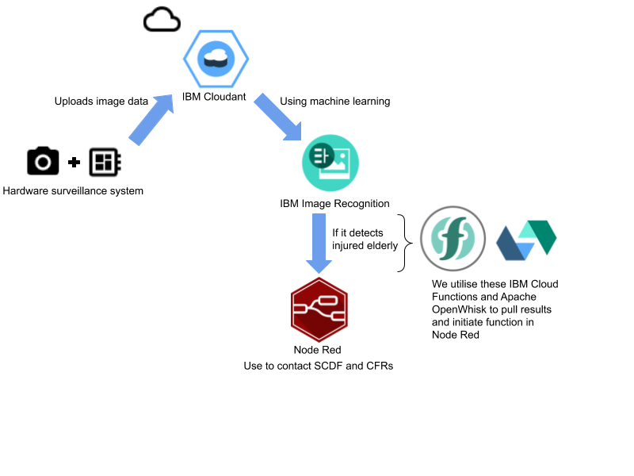
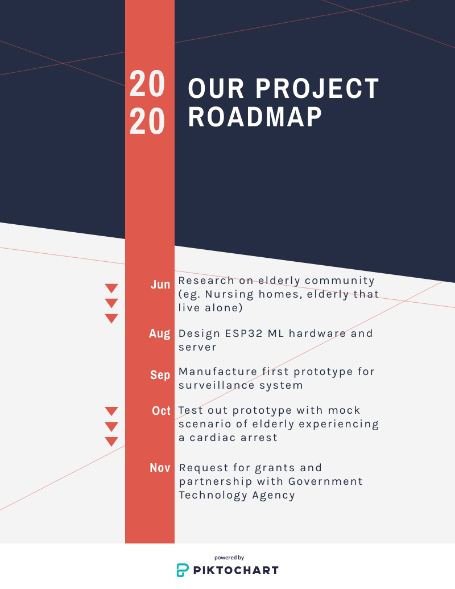

# Submission name
SCDF IBM Call for code

## Contents

1. [Short description](#short-description)
1. [The architecture](#the-architecture)
1. [Long description](#long-description)
1. [Project roadmap](#project-roadmap)
1. [Getting started](#getting-started)
1. [Built with](#built-with)
1. [Contributing](#contributing)
1. [Versioning](#versioning)
1. [Authors](#authors)
1. [License](#license)
1. [Acknowledgments](#acknowledgments)

## Short Description

Singapore is facing an ageing population and the elderly is expected to make up almost half of Singapore’s population by 2050. As a result, there will also be more of elderly who are living alone without next of kin, placing them at increased risk of injury at home without assistance.

### How can technology help us?
As more elderly will be living alone without next of kin, they may be at increased risk of stroke, or injury from falling down rendering them to be immobile (due to old age) and would not be able to contact emergency services on their own. Technology can help us by contacting SCDF directly to assist by transporting them directly to hospitals, community care centres etc.

### Our idea
Providing a set of open sourced services by using IBM Cloud and Watson services, develop a system that can help monitor the elderly’s house in event of accidents. This would allow an automated system to alert the respective parties of the elderly’s personal information, address, time of accident and type of accident (either falling down/ cardiac arrest/ stroke) by checking the camera footage. Furthermore this system should help streamline the transport of the elderly to the hospital. This can be achieved by using the system to extract the elderly’s address and using computer algorithms to plan the fastest route to the destination. The journey would also be sped up by alerting other drivers to avoid said path if they can so that there would be less traffic.

## The Architecture

## Long Description

## Project Roadmap

## Getting Started

## Built With

## Contributing

## Versioning

## Authors

## License

## Acknowledgments

