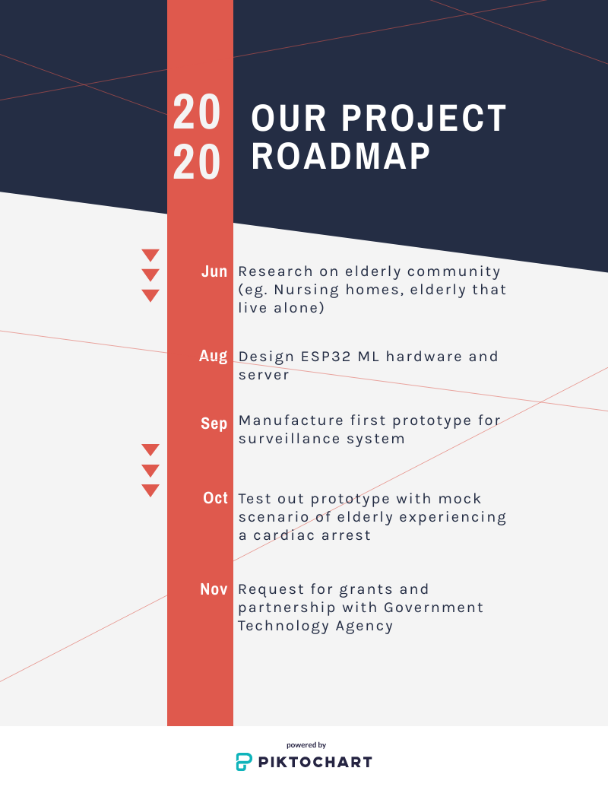
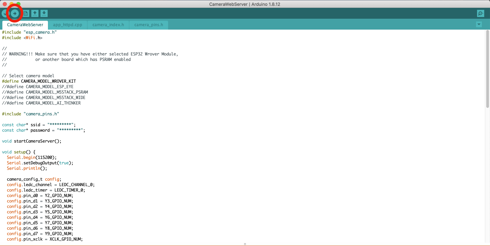

# I might put this on my CV
Group "I might put this on my CV"'s submission for SCDF X IBM - Lifesavers' Innovation Challenge: Call For Code 2020.

## Contents

1. [Short description](#short-description)
1. [The architecture](#the-architecture)
1. [Long description](#long-description)
1. [Project roadmap](#project-roadmap)
1. [Getting started](#getting-started)
1. [Built with](#built-with)
1. [Contributing](#contributing)
1. [Versioning](#versioning)
1. [Authors](#authors)
1. [License](#license)
1. [Acknowledgments](#acknowledgments)

## Short Description

Singapore is facing an ageing population and the elderly is expected to make up almost half of Singapore’s population by 2050. As a result, there will also be more of elderly who are living alone without next of kin, placing them at increased risk of injury at home without assistance.

### How can technology help us?
As more elderly will be living alone without next of kin, they may be at increased risk of stroke, or injury from falling down rendering them to be immobile (due to old age) and would not be able to contact emergency services on their own. Technology can help us by contacting SCDF directly to assist by transporting them directly to hospitals, community care centres etc.

### Our idea
Providing a set of open sourced services by using IBM Cloud and Watson services, develop a system that can help monitor the elderly’s house in event of accidents. This would allow an automated system to alert the respective parties of the elderly’s personal information, address, time of accident and type of accident (either falling down/ cardiac arrest/ stroke) by checking the camera footage. Furthermore this system should help streamline the transport of the elderly to the hospital. This can be achieved by using the system to extract the elderly’s address and using computer algorithms to plan the fastest route to the destination. The journey would also be sped up by alerting other drivers to avoid said path if they can so that there would be less traffic.

## The Architecture

## Long description
[Long description of our solution is found here](description.md)

## Project Roadmap

## Getting Started
Disclaimer: Code is not complete, it will not function

Clone the GitHub repo using the download as zip file or typing into command line:
`git clone https://github.com/BlueTan/i-m-not-gonna-put-this-in-my-CV`

### Hardware: ESP32 CAM
Connect ESP32 to computer using USB port, and flash the camera web server software using the Arduino IDE.

Press upload to flash software.

### Set up Cloudant and get API key

### Set up image recognition on IBM Watson Studio

Download both negative.zip and falling.zip, these will serve as the training set.

Log into IBM cloud, and go to Watson Studio. 

Create a new project, and name it *"Fall detection"*.

Press *"Add to new project"* and select *"Visual Recognition"*.

## Built With
* [IBM Cloudant](https://cloud.ibm.com/catalog?search=cloudant#search_results) - Database service used
* [IBM Cloud Functions (based on Apache OpenWhisk)](https://cloud.ibm.com/catalog?search=cloud%20functions#search_results) - To run our code
* [IBM Image Recognition](https://www.ibm.com/cloud/watson-visual-recognition) - Used to identify our target group
* [Node-RED](https://nodered.org/) - Programming tool to link our hardware and software together

